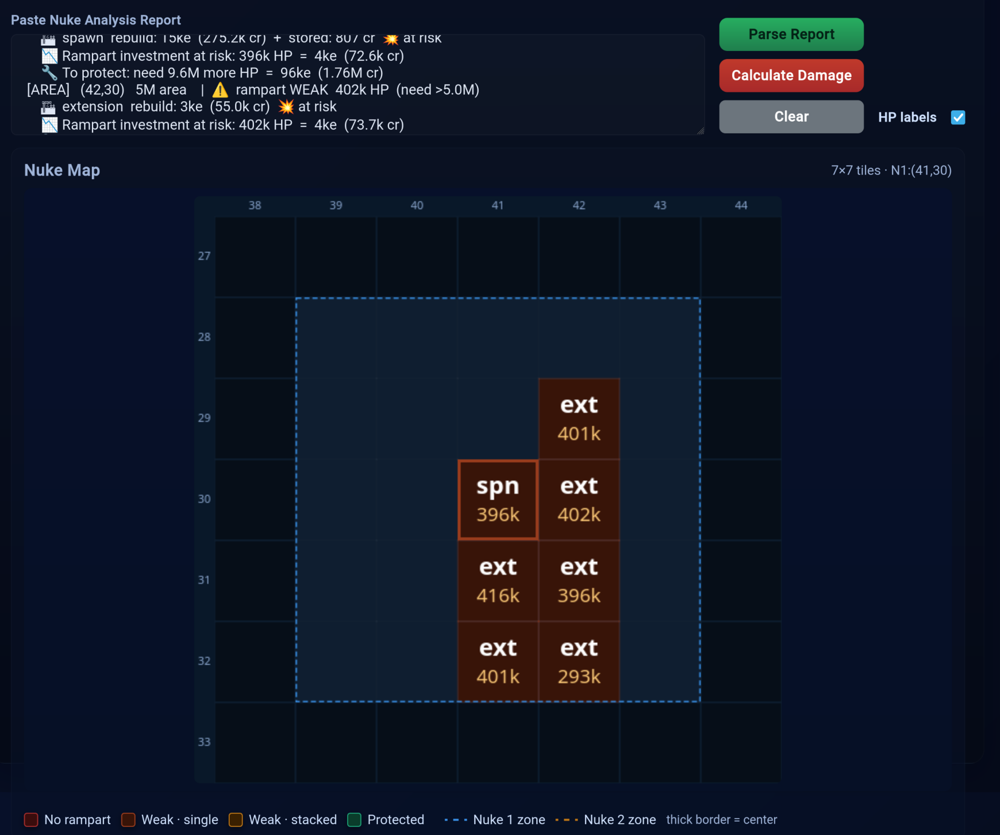
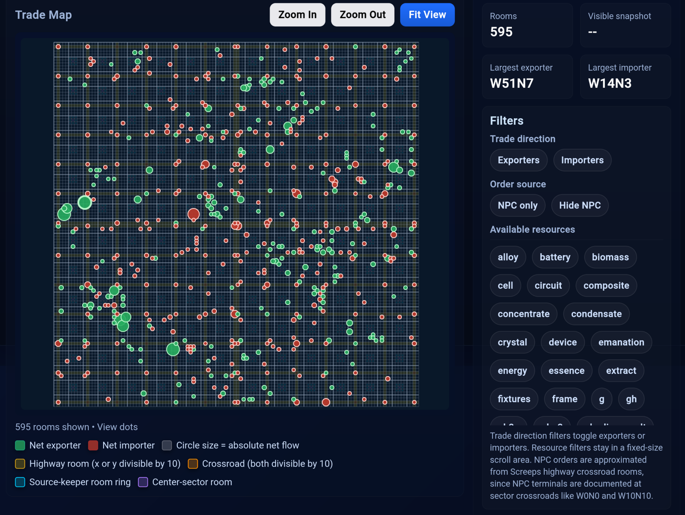

# Screeps Command Center

A single-file, browser-based toolkit for Screeps players. No build step, no dependencies, no server — open `ScreepsCommandCenter.html` and everything runs client-side. It bundles five utilities for planning offensives, sizing creeps, timing events, and visualizing market activity across the world map.

## Screenshots





---

## Features at a Glance

| Tab | Purpose |
|---|---|
| **Tick ETA** | Ticks → real-world duration, with timezone comparison and live countdown |
| **Time → Ticks** | Real-world date/time → tick count |
| **Nuke Simulator** | Paste a cost analysis report, visualize blast zones and rampart survivability |
| **Body Calculator** | Build and optimize creep bodies against an energy budget |
| **Market Map** | Pan/zoom world map of net exporters and importers from a trading summary |

---

## Screeps Integration

The Nuke Simulator and Market Map tabs are designed to work with two companion Screeps modules: `nukeAnalyze.js` and `marketMap.js`. You run commands in the Screeps console to generate reports, copy the output, and paste it into the frontend. This section covers how to install both modules and wire them into your codebase.

### Installing nukeAnalyze

**Step 1 — Add the file**

Copy `nukeAnalyze.js` into your Screeps source directory alongside your other modules (next to `main.js`, or inside `src/` if you use a bundler). The file name must match exactly what you `require()`.

**Step 2 — Wire it into main.js**

At the top of `main.js` with your other requires:

```js
const nukeAnalyzeModule = require('nukeAnalyze');
```

Then expose the console commands as globals, outside the loop:

```js
global.nukeAnalyze      = nukeAnalyzeModule.nukeAnalyze;
global.nukeAnalyzeSelf  = nukeAnalyzeModule.nukeAnalyzeSelf;
global.nukeAnalyzeCost  = nukeAnalyzeModule.nukeAnalyzeCost;
global.nukeIncoming     = nukeAnalyzeModule.nukeIncoming;
global.nukeThreat       = nukeAnalyzeModule.nukeThreat;
global.nukeThreatStatus = nukeAnalyzeModule.nukeThreatStatus;
global.nukeThreatCancel = nukeAnalyzeModule.nukeThreatCancel;
```

Finally, call the tick processor **inside your main loop** on every tick:

```js
module.exports.loop = function() {
    // ... your existing code ...
    nukeAnalyzeModule.processPendingNukeAnalyze();
    // ... rest of loop ...
};
```

`processPendingNukeAnalyze()` handles observer auto-complete. If you skip this call, commands that queue an observer request for a room you can't currently see will never resolve.

**Step 3 — Optional dependencies**

The module soft-requires three other modules at runtime. If you don't have them it still works — those features degrade gracefully:

| Module | Used for | Without it |
|---|---|---|
| `iff` | Whitelist check in `nukeThreat` — identifies friendly vs hostile players | Every player is treated as hostile |
| `marketBuy` | Buy-side energy and ghodium prices for credit cost estimates | Falls back to scanning `Game.market.getAllOrders()` directly |
| `roleOperator` | PWR_OPERATE_OBSERVER fallback for rooms out of standard observer range | Only standard observers are used |

### Installing marketMap

**Step 1 — Add the file**

Copy `marketMap.js` into the same directory as your other modules.

**Step 2 — Wire it into main.js**

```js
require('marketMap');
```

That single line is enough — the module registers `global.marketMap` itself at load time. If you prefer explicit control, `global.marketMap = require('marketMap')` is equivalent. No loop integration is needed; `marketMap` is a pure read operation that runs entirely within one console call.

### main.js checklist

```js
// 1. Require both modules
const nukeAnalyzeModule = require('nukeAnalyze');
require('marketMap');

// 2. Expose nukeAnalyze globals
global.nukeAnalyze      = nukeAnalyzeModule.nukeAnalyze;
global.nukeAnalyzeSelf  = nukeAnalyzeModule.nukeAnalyzeSelf;
global.nukeAnalyzeCost  = nukeAnalyzeModule.nukeAnalyzeCost;
global.nukeIncoming     = nukeAnalyzeModule.nukeIncoming;
global.nukeThreat       = nukeAnalyzeModule.nukeThreat;
global.nukeThreatStatus = nukeAnalyzeModule.nukeThreatStatus;
global.nukeThreatCancel = nukeAnalyzeModule.nukeThreatCancel;

// 3. Inside module.exports.loop — every tick
nukeAnalyzeModule.processPendingNukeAnalyze();
```

---

## Tick ETA

Converts a number of ticks into a real-world duration from **right now**, and optionally tells you the local clock time of arrival in two timezones.

### Inputs

- **Seconds per Tick** — The current server tick rate. Check [status.screeps.com](https://status.screeps.com) using the link on the tab; the rate varies by server and time of day. Typical values range from about 2.0 to 4.0 seconds per tick.
- **Number of Ticks** — How many ticks until the event. For a nuke this is 50,000; for spawn time multiply parts × 3; for anything else read the game's countdown directly.

### Optional: Timezone Comparison

Select values in both timezone dropdowns. Your local timezone is auto-detected and pre-filled. This is useful for planning attacks timed around an enemy player's sleep schedule — you see the arrival clock time in both timezones side by side.

### Output

- **Duration breakdown** — Days / hours / minutes / seconds remaining.
- **Arrival times** — Local clock time in each selected timezone, plus the calendar date if the arrival crosses midnight.
- **Live countdown** — A `HH:MM:SS` ticker that starts automatically and **persists across page reloads** via `localStorage`, so you can close and reopen the tab without losing your countdown. Click **Clear** to cancel it.

---

## Time → Ticks

The inverse of Tick ETA: given a future date and time of day, how many ticks away is it?

### Inputs

- **Seconds per Tick** — Same as above.
- **Target Date** — Use the date picker to choose the calendar day.
- **Time of Day** — Click the clock button to open the custom time picker. Use the ▲ / ▼ spinners (minutes step in increments of 5) or type directly into the fields. Toggle **AM / PM**, then click **Set Time** to confirm. Click **Clear** inside the popup to remove a previously set time (midnight is assumed when no time is set).

### Output

- **Tick count** — The number of ticks from now until the chosen moment, ceiling-rounded.
- **Human-readable summary** — Days, hours, and minutes remaining so you can sanity-check the result.

---

## Nuke Simulator

Visualizes the damage dealt by one or more nukes against a room's defenses. Works by parsing a pre-formatted cost analysis report, drawing a color-coded grid of every affected structure tile, and producing a per-structure damage summary.

### Step 1 — Generate a report in Screeps

Two commands produce the report format this tab expects:

**`nukeIncoming` — you have nukes landing on you**

This is the most common starting point. It scans your owned rooms for incoming nukes using `FIND_NUKES`, then automatically calls `nukeAnalyzeCost` with all landing positions at once so stacked tile damage is correctly calculated.

```js
nukeIncoming()           // All owned rooms
nukeIncoming('W1N46')    // One specific room
```

**`nukeAnalyzeCost` — manual strike analysis**

Use this when you already know the coordinates — for example, when scouting a room you're planning to attack and want to see what damage a strike at a specific tile would deal.

```js
// Single strike at (25, 25) in W5N10
nukeAnalyzeCost('W5N10', 25, 25)

// Multiple simultaneous strikes — tile damage is stacked automatically
nukeAnalyzeCost('W5N10', [{x:25, y:25}, {x:30, y:28}])
```

If the target room isn't currently visible, both commands automatically queue an observer request and print `🔭 Observing W5N10 … Auto-completing next tick.` — the result appears the following tick with no further action needed.

**Collecting the output**

All commands print directly to the Screeps console. Click inside the console output area, select the text of the report from the first `════` line to the last one, and copy it. You only need the report block itself, not surrounding log lines from other modules.

### Step 2 — Paste the report and click **Parse Report**

The parser extracts:

- **Nuke positions** — Tokens in the form `@ (x,y)` or `+ (x,y)` mark impact centers. More than one token means stacked nukes.
- **Structure coordinates** — Any line with a `(x,y)` pattern is associated with the nearest recognized building name (`spawn`, `tower`, `extension`, `lab`, `terminal`, `nuker`, `observer`, `storage`, `link`, `powerSpawn`).
- **Rampart HP** — Lines containing `rampart WEAK` or `rampart ok` followed by an HP value (e.g. `401k HP`) are parsed and attached to the tile.
- **Stacked damage** — If the report states a total like `= 15M stacked`, that value is used directly. Otherwise the tool calculates it: 10M at the direct center tile, 5M for every surrounding tile within radius 2, accumulated across multiple nukes.

A parse status message (e.g. `Parsed 1 nuke and 7 structures`) appears briefly below the buttons.

### Step 3 — Click **Calculate Damage**

This runs the damage math and populates:

- **Summary cards** — Counts of Destroyed / Defended / Exposed / Safe structures, plus total raw damage in megapoints.
- **Detailed report** — One entry per structure tile, showing damage dealt, HP remaining, and a colored badge (DESTROYED / DEFENDED / DAMAGED / SAFE).

### The Grid Map

Each cell represents one room tile within the blast bounding box. Tile colors:

| Color | Meaning |
|---|---|
| Dark red | No rampart — building will take full damage |
| Dark orange-red | Rampart present but below the damage threshold (single nuke) |
| Dark amber | Rampart present but below the stacked threshold (multiple nukes overlap here) |
| Dark green | Rampart HP exceeds incoming damage — building survives |

Dashed border outlines mark each nuke's 5×5 blast zone; a thicker border marks the center tile of each nuke. Zone outline colors cycle through blue → amber → red → green → purple for multiple nukes. Row/column coordinates are shown along the top and left edges.

### Interacting with the Map

- **Hover** a structure tile to see a tooltip: rampart HP, building HP, stacked damage, and survival status.
- **Click** a structure tile to jump to and highlight its entry in the damage report below. If the report hasn't been generated yet, it's generated automatically first.
- Toggle **HP labels** (checkbox in the controls) to show or hide the rampart HP value printed inside each tile. Labels appear when tiles are large enough (≥ 20 px per side).
- Click **Clear** to reset everything and start over.

### Expected Report Format

```
════════════════════════════════════════════════════════════════════════
NUKE COST ANALYSIS: E0N0 @ (41,30)  |  Owner: User  |  RCL: 7
════════════════════════════════════════════════════════════════════════
Energy price: 18.3470 cr/e  |  Structures in room: 87  |  Building tiles in blast: 7
PER-TILE BREAKDOWN:  (roads, walls, containers ignored; empty tiles omitted)
────────────────────────────────────────────────────────────────────────
  [AREA]   (42,29)   5M area    |  ⚠️  rampart WEAK  401k HP  (need >5.0M)
      🏗  extension  rebuild: 3ke  (55.0k cr)  💥 at risk
      📉 Rampart investment at risk: 401k HP  =  4ke  (73.6k cr)
      🔧 To protect: need 4.6M more HP  =  46ke  (843.8k cr)

  [CENTER] (41,30)  10M direct  |  ⚠️  rampart WEAK  396k HP  (need >10.0M)
      🏗  spawn  rebuild: 15ke  (275.2k cr)  +  stored: 807 cr  💥 at risk
      📉 Rampart investment at risk: 396k HP  =  4ke  (72.6k cr)
      🔧 To protect: need 9.6M more HP  =  96ke  (1.76M cr)

  ...
════════════════════════════════════════════════════════════════════════
REPLACEMENT COST  (all buildings in blast, ignoring rampart protection):
  Build energy:     33ke  (605.5k cr)
  Lost resources:   807 cr
  TOTAL:            606.3k cr
...
════════════════════════════════════════════════════════════════════════
```

The `@` (or `+`) before the coordinates in the header marks the nuke center. Multiple `@ (x,y)` tokens produce multiple overlapping blast zones.

### nukeAnalyze Console Command Reference

**Generating reports for the frontend:**

| Command | When to use |
|---|---|
| `nukeIncoming()` | You've received a nuke warning — scans all owned rooms and generates a stacked-damage report automatically |
| `nukeIncoming('ROOM')` | Same, limited to one room |
| `nukeAnalyzeCost('ROOM', x, y)` | You know the coordinates — generates a report for one strike |
| `nukeAnalyzeCost('ROOM', [{x,y},…])` | Multiple simultaneous strikes with stacked damage |

**Other offensive planning tools (output is not pasted into the frontend):**

| Command | What it does |
|---|---|
| `nukeAnalyze('ROOM')` | Find the single best offensive strike position by credit value |
| `nukeAnalyze('ROOM', N)` | Find the best N sequential strike positions |
| `nukeAnalyzeSelf()` | Compact best-strike summary for all your owned rooms |
| `nukeThreat('ROOM')` | Scan surrounding rooms for hostile nukers; test if they can destroy all key structures |
| `nukeThreatStatus('ROOM')` | Check progress of an active threat scan |
| `nukeThreatCancel('ROOM')` | Cancel and clean up a threat scan |

---

## Body Calculator

Builds a creep body part by part, reports cost and spawn time, and can auto-optimize CARRY/MOVE pairs to fill a given energy budget.

### Inputs

- **Energy Budget** — Used by **Auto-Optimize** to fill CARRY+MOVE pairs to the maximum affordable count (capped at 25 pairs / 50 parts).
- **Max Body Parts** — A reference cap displayed alongside the body size output; the game hard-caps at 50.
- **Role Template** — Selecting a preset fills all part fields with a balanced starting configuration:

| Template | Parts |
|---|---|
| Harvester | 6 WORK · 1 CARRY · 3 MOVE |
| Hauler | 8 CARRY · 8 MOVE |
| Upgrader | 8 WORK · 2 CARRY · 2 MOVE |
| Attacker | 8 ATTACK · 8 MOVE · 4 TOUGH |
| Ranger | 8 RANGED · 8 MOVE · 2 TOUGH |
| Healer | 8 HEAL · 8 MOVE |

You can tweak any field after applying a template.

- **Individual part counts** — WORK, CARRY, MOVE, ATTACK, RANGED (RANGED_ATTACK), HEAL, TOUGH, CLAIM.

### Buttons

- **Calculate Body** — Instantly shows total energy cost, body size vs. the 50-part cap, and spawn time (parts × 3 ticks, converted to minutes and seconds).
- **Auto-Optimize** — Ignores all current part counts and fills the body with as many CARRY+MOVE pairs as the budget allows (max 25 pairs), then recalculates.

### Part Costs Reference

| Part | Cost |
|---|---|
| WORK | 100 |
| CARRY | 50 |
| MOVE | 50 |
| ATTACK | 80 |
| RANGED_ATTACK | 150 |
| HEAL | 250 |
| TOUGH | 10 |
| CLAIM | 600 |

---

## Market Map

Renders a pan/zoom world map of net exporters (green circles) and importers (red circles) from a pasted trading summary. Circle size scales to absolute net flow volume — the bigger the circle, the more resource is moving through that room.

### Step 1 — Generate a report in Screeps

Type this in the Screeps console:

```js
marketMap()
```

The function scans `Game.market.getAllOrders()`, groups active sell and buy orders by room, calculates net flow per room, and tags each resource with `(^)` sold, `(v)` bought, or `(B)` both. Output:

```
Room    |         Sells |          Buys |           Net | Resources
------------------------------------------------------------------------
W51N7   | 1,015,667,400 |             0 | +1,015,667,400 | power(^) silicon(^)
W14N3   |             0 |   740,693,610 |  -740,693,610 | energy(v)
E43N53  |     1,420,633 |     3,098,198 |    -1,677,565 | power(B) G(v)
```

You can optionally prepend snapshot metadata lines before pasting — the frontend will display them in the sidebar:

```
Hourly snapshots recorded: 24
Last snapshot: 2024-01-15 03:00 UTC
Room    | Sells | ...
```

**Collecting the output:** click inside the Screeps console, select the entire table from the header row through the last data row, and copy it. Include the header row (`Room | Sells | ...`) — the parser uses it for column alignment. The separator line (`---...`) is ignored automatically.

### Step 2 — Paste data and click **Process Data**

The parser accepts lines in this format:

```
Room | Sells | Buys | Net | Resources
W51N7  | 1,015,667,400 | 0 | +1,015,667,400 | alloy(^) silicon(^)
W14N3  | 0 | 740,693,610 | -740,693,610 | energy(v)
```

Numbers may include commas. The `+` or `-` sign on `Net` is optional. The header row and separator lines are ignored. Click **Load Example** to populate a small demo dataset without pasting anything.

### Navigating the Map

| Action | Result |
|---|---|
| Scroll wheel / pinch | Zoom in or out, centered on cursor |
| Click and drag | Pan the map |
| Click a circle | Select that room — details appear in the sidebar |
| Double-click a circle | Select and center the view on that room |
| **Zoom In / Zoom Out** buttons | Fixed zoom steps centered on the canvas |
| **Fit View** | Reset pan and zoom to show all rooms |

The map automatically switches rendering detail based on zoom level:

- **Dots** (zoomed out) — Minimal circles only, no labels.
- **Compact** (mid zoom) — Room name labels added.
- **Detailed** (zoomed in) — Full room name, signed net flow, and resource string shown per circle.

### Room Type Highlighting

The grid background tints rooms by type before any circles are drawn:

| Tint | Room type |
|---|---|
| Gold / yellow | Highway room — one coordinate is divisible by 10 |
| Orange | Crossroad — both coordinates divisible by 10 (also used as the NPC terminal approximation) |
| Cyan | Source-keeper rooms — inner ring of a sector (coordinates mod 10 in 4–6, excluding center) |
| Purple | Center-sector room — both coordinates mod 10 = 5 |

### Filters (sidebar)

All filters combine — only rooms matching every active filter are drawn.

- **Trade direction** — Toggle **Exporters** to show only rooms with positive net flow, or **Importers** for negative. Click the active button again to clear the filter.
- **Order source** — Toggle **NPC only** to show only crossroad rooms (where NPC terminals are documented), or **Hide NPC** to exclude them. Useful for separating player order volume from NPC terminal volume. Click again to clear.
- **Available resources** — Click a resource chip to filter for rooms that traded that resource. Click the active chip again to clear. Only one resource filter can be active at a time. The chip list is built from whatever resources appear in the pasted data.

### Sidebar Stats

- **Rooms** — Count of rooms currently visible after filters.
- **Visible snapshot** — The `Hourly snapshots recorded` value from the pasted header, if present.
- **Largest exporter / importer** — The room with the highest absolute positive / negative net flow among currently visible rooms.
- **Selected Room** — Detailed breakdown for the last clicked room: net flow, sells vs. buys, raw resource string, parsed route markers with their meanings and color-coded direction pills, and snapshot metadata.

---

## Technical Notes

- Pure HTML/CSS/JS in a single file; both maps render via the Canvas 2D API.
- No external libraries or network calls. All computation is client-side.
- The live countdown is the only data persisted across sessions (browser `localStorage` under key `scc_countdown_target`).
- NPC order rooms are **approximated** from highway crossroads (both coordinates divisible by 10). The actual documented NPC terminal positions in Screeps are at sector crossroads such as W0N0 and W10N10, which correspond to this heuristic.
- Room coordinate convention: `E`/`N` map to non-negative axes, `W`/`S` to negative (`Wn` → `-(n+1)`), matching Screeps' internal world layout.

---

## License

CC BY-NC